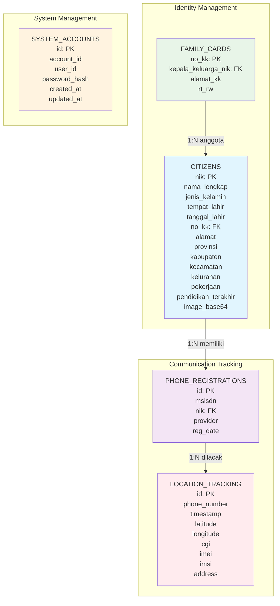
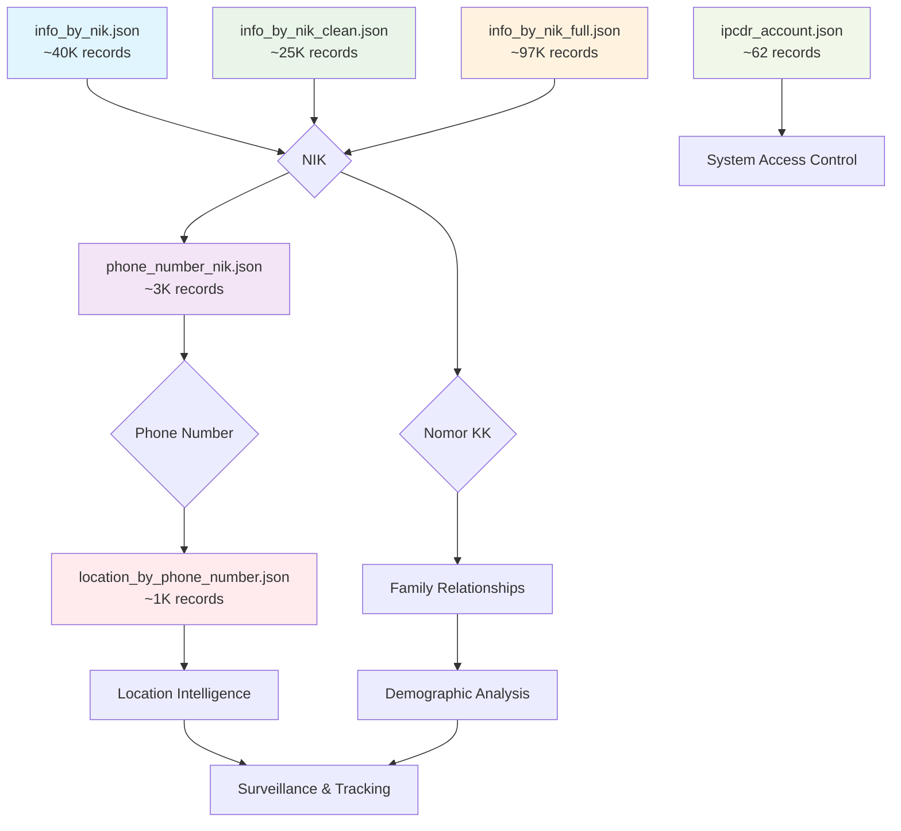
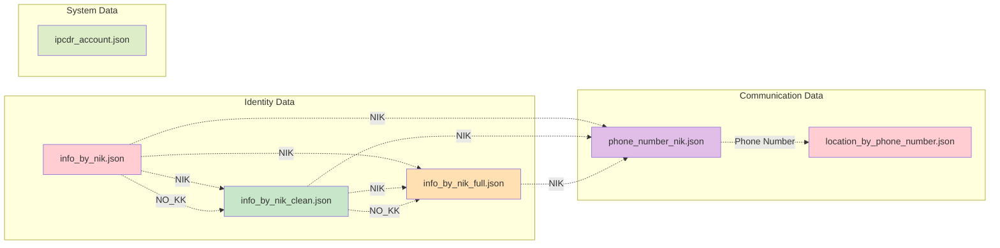

# Database Correlation Documentation (IPCDR)

## Overview
Dokumentasi ini menjelaskan korelasi dan hubungan antar data dalam berbagai file JSON yang terdapat dalam sistem IPCDR (IP Call Detail Record).

## File Structure Analysis

### 1. info_by_nik.json
**Deskripsi**: Data identitas lengkap berdasarkan NIK dengan foto dan informasi keluarga
**Total Records**: ~40,098 records
**Key Fields**:
- `nik` (Primary Key) - Nomor Induk Kependudukan
- `image` - Base64 encoded photo
- `nama_lengkap` - Nama lengkap
- `ttl` - Tempat tanggal lahir
- `nkk` - Nomor Kartu Keluarga
- `nama_lengkap_ayah`, `nama_lengkap_ibu` - Data orang tua
- `alamat`, `provinsi`, `kabupaten`, `kecamatan`, `kelurahan` - Data alamat
- `pekerjaan`, `pendidikan_terakhir` - Data sosial ekonomi

### 2. info_by_nik_clean.json
**Deskripsi**: Data identitas dalam format terstruktur dengan kode numerik
**Total Records**: ~25,002 records
**Key Fields**:
- `NIK` (Primary Key) - Nomor Induk Kependudukan
- `NAMA_LGKP` - Nama lengkap
- `JENIS_KLMIN` - Jenis kelamin (kode: 1=Laki-laki, 2=Perempuan)
- `TMPT_LHR`, `TGL_LHR` - Tempat dan tanggal lahir
- `GOL_DRH` - Golongan darah (kode numerik)
- `AGAMA` - Agama (kode numerik)
- `STAT_KWN` - Status perkawinan (kode numerik)
- `NO_KK` - Nomor Kartu Keluarga
- `NO_PROP`, `NO_KAB`, `NO_KEC`, `NO_KEL` - Kode wilayah administratif

### 3. info_by_nik_full.json
**Deskripsi**: Data identitas lengkap dengan informasi tambahan dokumen dan administrasi
**Total Records**: ~97,002 records
**Key Fields**:
- `NIK` (Primary Key) - Nomor Induk Kependudukan
- `NO_KTP` - Nomor KTP
- `NO_PASPOR` - Nomor paspor
- `AKTA_LHR`, `NO_AKTA_LHR` - Data akta kelahiran
- `AKTA_KWN`, `NO_AKTA_KWN`, `TGL_KWN` - Data akta perkawinan
- `AKTA_CRAI`, `NO_AKTA_CRAI`, `TGL_CRAI` - Data akta perceraian
- `NAMA_PET_REG`, `NIP_PET_REG` - Data petugas registrasi
- `TGL_ENTRI`, `TGL_UBAH` - Timestamp administrasi
- `TGL_CETAK_KTP`, `TGL_GANTI_KTP` - Data administrasi KTP

### 4. phone_number_nik.json
**Deskripsi**: Mapping antara nomor telepon dan NIK dengan data provider
**Total Records**: ~2,972 records
**Key Fields**:
- `msisdn` - Nomor telepon (format internasional)
- `nik` - NIK pemilik nomor telepon
- `provider` - Provider telekomunikasi (TELKOMSEL, INDOSAT, HUTCHISON_3, EXELCOMINDO)
- `reg_date` - Tanggal registrasi nomor

### 5. location_by_phone_number.json
**Deskripsi**: Data lokasi tracking berdasarkan nomor telepon
**Total Records**: ~1,164 records
**Key Fields**:
- `id` (Primary Key) - ID unik record
- `phone_number` - Nomor telepon
- `date` - Timestamp lokasi
- `cgi` - Cell Global Identity
- `coordinate` - Koordinat GPS (latitude,longitude)
- `imei` - International Mobile Equipment Identity
- `imsi` - International Mobile Subscriber Identity
- `address` - Alamat lengkap lokasi
- `maps` - Link Google Maps

### 6. ipcdr_account.json
**Deskripsi**: Data akun sistem IPCDR
**Total Records**: ~62 records
**Key Fields**:
- `id` (Primary Key) - ID unik akun
- `account_id` - ID akun
- `user_id` - ID pengguna
- `password` - Password terenkripsi
- `provider_id` - ID provider (credential)
- `created_at`, `updated_at` - Timestamp

## Data Correlations & Relationships

### Entity Relationship Diagram



### Data Flow Diagram



### File Correlation Matrix



### Primary Correlations

#### 1. NIK sebagai Primary Key
```
info_by_nik.json (nik) ←→ info_by_nik_clean.json (NIK)
info_by_nik.json (nik) ←→ info_by_nik_full.json (NIK)
info_by_nik.json (nik) ←→ phone_number_nik.json (nik)
```

#### 2. Phone Number Correlation
```
phone_number_nik.json (msisdn) ←→ location_by_phone_number.json (phone_number)
```

#### 3. Family Relationship (Kartu Keluarga)
```
info_by_nik.json (nkk) ←→ info_by_nik_clean.json (NO_KK)
info_by_nik_clean.json (NO_KK) ←→ info_by_nik_full.json (NO_KK)
```

### Secondary Correlations

#### 1. Geographic Data
- Wilayah administratif dapat dikorelasikan antara:
  - `info_by_nik.json` (provinsi, kabupaten, kecamatan, kelurahan)
  - `info_by_nik_clean.json` (NO_PROP, NO_KAB, NO_KEC, NO_KEL)
  - `location_by_phone_number.json` (address)

#### 2. Device Tracking
- IMEI dan IMSI dalam `location_by_phone_number.json` dapat digunakan untuk tracking perangkat
- CGI (Cell Global Identity) untuk identifikasi cell tower

## Database Schema Recommendations

### Tabel Utama yang Disarankan:

#### 1. citizens (dari info_by_nik_*)
```sql
CREATE TABLE citizens (
    nik VARCHAR(16) PRIMARY KEY,
    nama_lengkap VARCHAR(255),
    jenis_kelamin ENUM('LAKI-LAKI', 'PEREMPUAN'),
    tempat_lahir VARCHAR(255),
    tanggal_lahir DATE,
    no_kk VARCHAR(16),
    alamat TEXT,
    provinsi VARCHAR(100),
    kabupaten VARCHAR(100),
    kecamatan VARCHAR(100),
    kelurahan VARCHAR(100),
    -- fields lainnya
    INDEX idx_no_kk (no_kk),
    INDEX idx_nama (nama_lengkap)
);
```

#### 2. phone_registrations (dari phone_number_nik.json)
```sql
CREATE TABLE phone_registrations (
    id INT AUTO_INCREMENT PRIMARY KEY,
    msisdn VARCHAR(15),
    nik VARCHAR(16),
    provider ENUM('TELKOMSEL', 'INDOSAT', 'HUTCHISON_3', 'EXELCOMINDO'),
    reg_date DATE,
    FOREIGN KEY (nik) REFERENCES citizens(nik),
    INDEX idx_msisdn (msisdn),
    INDEX idx_nik (nik)
);
```

#### 3. location_tracking (dari location_by_phone_number.json)
```sql
CREATE TABLE location_tracking (
    id INT AUTO_INCREMENT PRIMARY KEY,
    phone_number VARCHAR(15),
    timestamp DATETIME,
    latitude DECIMAL(10, 8),
    longitude DECIMAL(11, 8),
    cgi VARCHAR(20),
    imei VARCHAR(15),
    imsi VARCHAR(15),
    address TEXT,
    INDEX idx_phone (phone_number),
    INDEX idx_timestamp (timestamp),
    INDEX idx_imei (imei)
);
```

#### 4. system_accounts (dari ipcdr_account.json)
```sql
CREATE TABLE system_accounts (
    id VARCHAR(26) PRIMARY KEY,
    account_id VARCHAR(26),
    user_id VARCHAR(26),
    password_hash TEXT,
    created_at TIMESTAMP,
    updated_at TIMESTAMP
);
```

## Data Quality Issues

### 1. Inkonsistensi Format
- NIK format berbeda antara file (dengan/tanpa quotes)
- Nomor telepon format berbeda (dengan/tanpa prefix 62)
- Timestamp format bervariasi

### 2. Data Missing/NULL
- Banyak field NULL dalam info_by_nik_full.json
- Beberapa NIK tidak memiliki korelasi phone number

### 3. Duplikasi Data
- Kemungkinan duplikasi NIK antar file
- Satu NIK bisa memiliki multiple phone numbers

## Rekomendasi Implementasi

### 1. Data Normalization
- Standardisasi format NIK (16 digit)
- Standardisasi format nomor telepon (62xxx)
- Unifikasi format timestamp

### 2. Data Validation
- Validasi NIK format dan checksum
- Validasi nomor telepon Indonesia
- Validasi koordinat GPS

### 3. Indexing Strategy
- Primary index pada NIK
- Secondary index pada nomor telepon
- Spatial index untuk koordinat lokasi
- Composite index untuk query kompleks

### 4. Privacy & Security
- Enkripsi data sensitif (NIK, nomor telepon)
- Audit trail untuk akses data
- Role-based access control

## Kesimpulan

Data IPCDR memiliki struktur yang kompleks dengan multiple correlation points. NIK berfungsi sebagai primary key utama yang menghubungkan data identitas, sementara nomor telepon menjadi bridge ke data lokasi tracking. Implementasi database yang tepat memerlukan normalisasi data, validasi yang ketat, dan strategi indexing yang optimal untuk mendukung query performance yang baik.